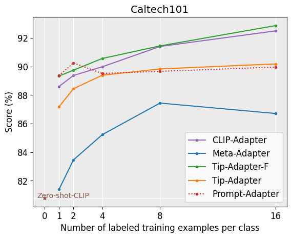
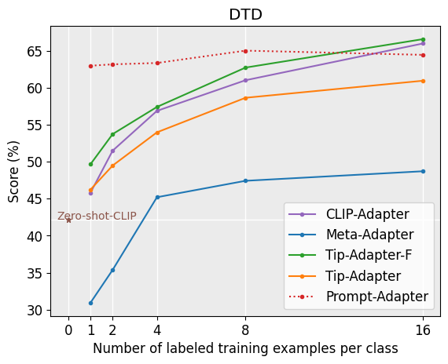
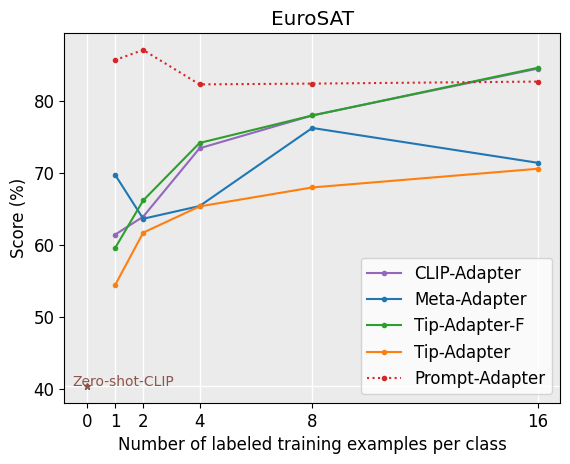
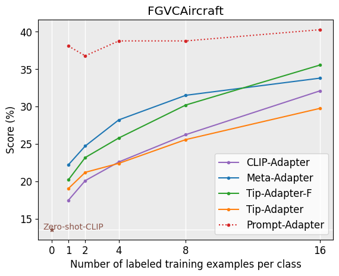
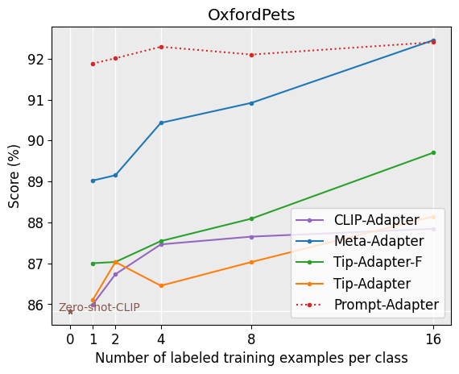
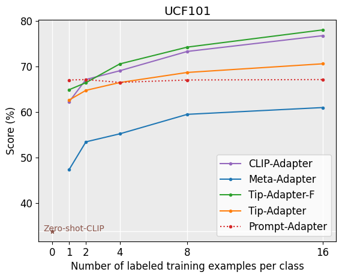
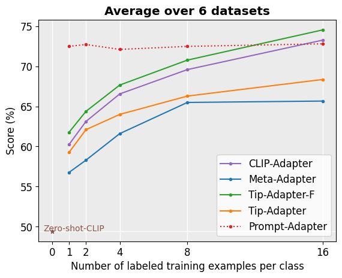

# Prompt-Adapter : Prompt Tuning based Few-shot Learner for Vision-Language Model 

This project aims at improving the performance of CLIP(Contrastive Language-Image Pretraining) for Few-Shot Classification tasks. The original CLIP uses manual handcrafted prompts, which is the limitation to be solved.
Hence a new method is introduced that combines pre-trained prompt tuning with a learnable filter on textual features under the guidance of few-shot image samples, which is based on the gated multi-head attention mechanism.<p>
First the prompts are learned using the method introduced in [Coop](https://arxiv.org/abs/2109.01134). Then we initialize the learned prompt into the [Meta-Adapter](https://arxiv.org/pdf/2311.03774) for Few-Shot Classification Task. Extensive experiments are conducted to beat the state-of-the-art methods in few-shot image classification on 6 publicly available datasets, especially in settings with limited data instances such as 1, 2, 4, 8, and 16-shot images.

## Code Usage
This code is built on top of the toolbox [Dassl.pytorch](https://github.com/KaiyangZhou/Dassl.pytorch) so you need to install the `dassl` environment first. Simply follow the instructions described [here](https://github.com/KaiyangZhou/Dassl.pytorch#installation) to install `dassl` as well as PyTorch.<p>

Follow [guidelines](https://github.com/KaiyangZhou/CoOp/blob/main/DATASETS.md) to install the datasets or use the bash script to download the datasets.
```bash
bash data.sh
```
The prompts are trained using the code of [Coop](https://github.com/KaiyangZhou/CoOp). Pretrained prompts can also be found inside `pretrained_prompt` folder.<p>

The running configurations can be modified in `configs/<dataset>.yaml`, including shot numbers, visual encoders, and hyperparamters. Just change `root_path` in `configs/<dataset>.yaml` accordingly.<p>
To generate the Few-Shot results run
```bash
python main.py --config ./configs/<dataset>.yaml
```

## Results

Results are stored in `Results.xlsx` file and `plot_curves.py` script generates the plots for every few-shot setting along with average over 6 datasets.<p>
<p align="center"> &emsp;  &emsp; </p>

<p align="center"> &emsp;  &emsp; </p>

<p align="center"> </p>

## Acknowledgement
This repo benefits from [Meta-Adapter](https://github.com/ArsenalCheng/Meta-Adapter) and [CoOp](https://github.com/KaiyangZhou/CoOp). Thanks for their wonderful works.
